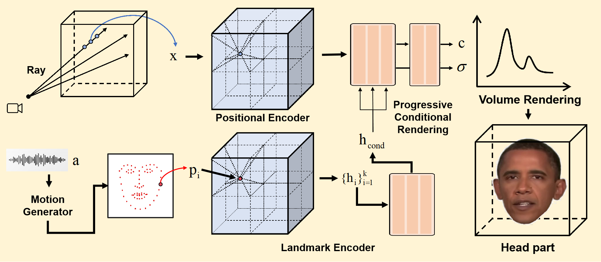

# R2-Talker: Realistic Real-Time Talking Head Synthesis with Hash Grid Landmarks Encoding and Progressive Multilayer Conditioning


[](https://arxiv.org/abs/2312.05572)
[](https://github.com/KylinYee/R2-Talker-code.git) 
[](https://github.com/KylinYee/R2-Talker-code)


This is the official repository for the paper: [R2-Talker: Realistic Real-Time Talking Head Synthesis with Hash Grid Landmarks Encoding and Progressive Multilayer Conditioning](https://arxiv.org/abs/2312.05572).

###  [Project](https://kylinyee.github.io/R2-Talker/) | [ArXiv](https://arxiv.org/abs/2312.05572) | [Video](https://www.youtube.com/watch?v=pdGFnCBiU5Y)




# 0.Supported Features
- &#x2610; Add progressive optimization for hash grid
- &#x2610; Add landmark generator
- &#x2611; Add landmark encoder
- &#x2611; Support methods: R2-Talker, RAD-NeRF, Geneface+instant-ngp 

| Method  | Driving Features | Audio Encoder |
| ------- | ---------------- | ------------- |
| [R2-Talker](https://github.com/KylinYee/R2-Talker-code/master) | 3D Facial Landmarks  | Hash grid encoder       |
| [RAD-NeRF](https://github.com/ashawkey/RAD-NeRF)               | Audio Features       | Audio Feature Extractor |
| [Geneface+instant-ngp](https://github.com/yerfor/GeneFace)     | 3D facial landmarks  | Audio Feature Extractor |                 
 

# 1.Install 
<details>
<summary> Install dependency & Build extension (optional) </summary>

Tested on Ubuntu 22.04, Pytorch 1.12 and CUDA 11.6.
```bash
git clone git@github.com:KylinYee/R2-Talker-code.git
cd R2-Talker-code
```


### Install dependency
```bash
# for ubuntu, portaudio is needed for pyaudio to work.
sudo apt install portaudio19-dev

pip install -r requirements.txt
```

### Build extension (optional)
By default, we use [`load`](https://pytorch.org/docs/stable/cpp_extension.html#torch.utils.cpp_extension.load) to build the extension at runtime.
However, this may be inconvenient sometimes.
Therefore, we also provide the `setup.py` to build each extension:
```bash
# install all extension modules
bash scripts/install_ext.sh
```
</details>


# 2.Data pre-processing
<details>
<summary> Preparation & Pre-processing Custom Training Video </summary>

### Preparation:

```bash
## install pytorch3d
pip install "git+https://github.com/facebookresearch/pytorch3d.git"

## prepare face-parsing model
wget https://github.com/YudongGuo/AD-NeRF/blob/master/data_util/face_parsing/79999_iter.pth?raw=true -O data_utils/face_parsing/79999_iter.pth

## prepare basel face model
# 1. download `01_MorphableModel.mat` from https://faces.dmi.unibas.ch/bfm/main.php?nav=1-2&id=downloads and put it under `data_utils/face_tracking/3DMM/`
# 2. download other necessary files from AD-NeRF's repository:
wget https://github.com/YudongGuo/AD-NeRF/blob/master/data_util/face_tracking/3DMM/exp_info.npy?raw=true -O data_utils/face_tracking/3DMM/exp_info.npy
wget https://github.com/YudongGuo/AD-NeRF/blob/master/data_util/face_tracking/3DMM/keys_info.npy?raw=true -O data_utils/face_tracking/3DMM/keys_info.npy
wget https://github.com/YudongGuo/AD-NeRF/blob/master/data_util/face_tracking/3DMM/sub_mesh.obj?raw=true -O data_utils/face_tracking/3DMM/sub_mesh.obj
wget https://github.com/YudongGuo/AD-NeRF/blob/master/data_util/face_tracking/3DMM/topology_info.npy?raw=true -O data_utils/face_tracking/3DMM/topology_info.npy
# 3. run convert_BFM.py
cd data_utils/face_tracking
python convert_BFM.py
cd ../..

## prepare ASR model
# if you want to use DeepSpeech as AD-NeRF, you should install tensorflow 1.15 manually.
# else, we also support Wav2Vec in PyTorch.
```

### Pre-processing Custom Training Video
* Put training video under `data/<ID>/<ID>.mp4`.

    The video **must be 25FPS, with all frames containing the talking person**. 
    The resolution should be about 512x512, and duration about 1-5min.
    ```bash
    # an example training video from AD-NeRF
    mkdir -p data/obama
    wget https://github.com/YudongGuo/AD-NeRF/blob/master/dataset/vids/Obama.mp4?raw=true -O data/obama/obama.mp4
    ```

* Run script (may take hours dependending on the video length)
    ```bash
    # run all steps
    python data_utils/process.py data/<ID>/<ID>.mp4

    # if you want to run a specific step 
    python data_utils/process.py data/<ID>/<ID>.mp4 --task 1 # extract audio wave
    ```

* 3D facial landmark generator will be added in the feature. If you want to process the custom data, please ref to [Geneface](https://github.com/yerfor/GeneFace/blob/main/docs/process_data/process_target_person_video.md) to obtain `trainval_dataset.npy`, using our `binarizedFile2landmarks.py` to extract landmarks and put the landmarks to `data/<ID>/`.

* File structure after finishing all steps:
    ```bash
    ./data/<ID>
    ├──<ID>.mp4 # original video
    ├──ori_imgs # original images from video
    │  ├──0.jpg
    │  ├──0.lms # 2D landmarks
    │  ├──...
    ├──gt_imgs # ground truth images (static background)
    │  ├──0.jpg
    │  ├──...
    ├──parsing # semantic segmentation
    │  ├──0.png
    │  ├──...
    ├──torso_imgs # inpainted torso images
    │  ├──0.png
    │  ├──...
    ├──aud.wav # original audio 
    ├──aud_eo.npy # audio features (wav2vec)
    ├──aud.npy # audio features (deepspeech)
    ├──bc.jpg # default background
    ├──track_params.pt # raw head tracking results
    ├──transforms_train.json # head poses (train split)
    ├──transforms_val.json # head poses (test split)
    |——aud_idexp_train.npy # head landmarks (train split)
    |——aud_idexp_val.npy # head landmarks (test split)
    |——aud_idexp.npy # head landmarks
    ```

For your convenience, we provide some processed results of the Obama video [here](https://drive.google.com/drive/folders/1TYLqErPReo0KM3IdskfW9tY-TZlbxkic?usp=drive_link). And you can also download more raw videos from geneface [here](https://drive.google.com/drive/folders/1vimGVNvP6d6nmmc8yAxtWuooxhJbkl68).

</details>


# 3.Usage
<details>
<summary> Quick Start & Detailed Usage </summary>

### Quick Start

We have prepared relevant materials [here](https://drive.google.com/drive/folders/11XgaNwlx3MDDJ7teFiLOe3VW2cT13-5X?usp=drive_link).
Please download these materials and put them in the new `pretrained` file
* File structure after finishing all steps:
    ```bash
    ./pretrained
    ├──r2talker_Obama_idexp_torso.pth # pretrained model 
    ├──test_eo.npy # driving audio features (wav2vec)
    ├──test_lm3ds.npy # driving audio features (landmarks)
    ├──test.wav # raw driving audio
    ├──bc.jpg # default background
    ├──transforms_val.json # head poses
    ├──test.mp4 # raw driving video
    ```

    
* Run inference:
    ```bash
    # save video to trail_test/results/*.mp4
    sh scripts/test_pretrained.sh
    ```

### Detailed Usage

First time running will take some time to compile the CUDA extensions.

```bash
# step.1 train (head)
# by default, we load data from disk on the fly.
# we can also preload all data to CPU/GPU for faster training, but this is very memory-hungry for large datasets.
# `--preload 0`: load from disk (default, slower).
# `--preload 1`: load to CPU, requires ~70G CPU memory (slightly slower)
# `--preload 2`: load to GPU, requires ~24G GPU memory (fast)
python main.py data/Obama/ --workspace trial_r2talker_Obama_idexp/ -O --iters 200000 --method r2talker --cond_type idexp

# step.2 train (finetune lips for another 50000 steps, run after the above command!)
python main.py data/Obama/ --workspace trial_r2talker_Obama_idexp/ -O --finetune_lips --iters 250000 --method r2talker --cond_type idexp


# step.3 train (torso)
# <head>.pth should be the latest checkpoint in trial_obama
python main.py data/Obama/ --workspace trial_r2talker_Obama_idexp_torso/ -O --torso --iters 200000 --head_ckpt trial_r2talker_Obama_idexp/checkpoints/ngp_ep0035.pth  --method r2talker --cond_type idexp
```

check the `scripts` directory for more provided examples.
</details>


# 4.Acknowledgement

This code is developed heavily relying on [RAD-NeRF](https://github.com/ashawkey/RAD-NeRF), [GeneFace](https://github.com/yerfor/GeneFace), and [AD-NeRF](https://github.com/YudongGuo/AD-NeRF).  Thanks for these great projects.


# 5.Citation

```
@article{zhiling2023r2talker,
  title={R2-Talker: Realistic Real-Time Talking Head Synthesis with Hash Grid Landmarks Encoding and Progressive Multilayer Conditioning},
  author={Zhiling Ye, Liangguo Zhang, Dingheng Zeng, Quan Lu, Ning Jiang},
  journal={arXiv preprint arXiv:2312.05572},
  year={2023}
}
```
